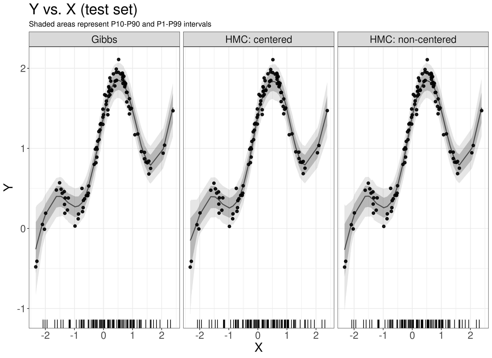
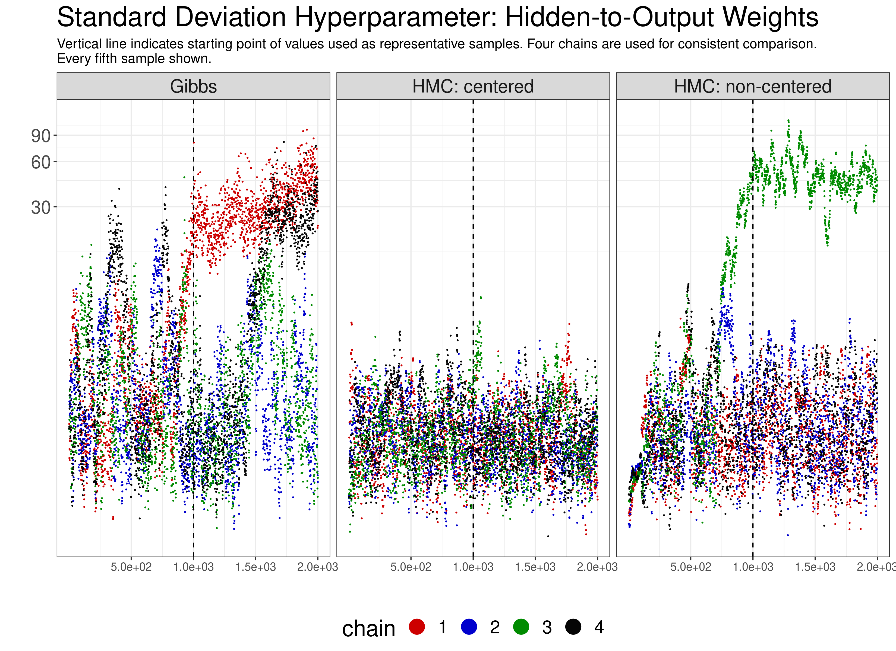

# BNNs

This repository benchmarks the performance of various probabilistic programming packages on hierarchical models (specifically hierarchical Bayesian Neural Networks). We are particularly interested in how **Hamiltonian Monte Carlo (HMC)** methods can be used to sample higher-level hyperparameters in such networks, without the need to compose different sampling methods by parameter group.

Implementations in the following packages are available:

- Stan (centered and non-centered parametrization)
- PyMC3
- TF Probability
- Pyro/PyTorch (to follow)

The results for all these packages are benchmarked against Radford Neal's **Flexible Bayesian Modelling (FBM)** implementation (the details of which can be found in his thesis). Because conditional distributions of hyperparameters given weights are analytically tractable, Neal's FBM uses Gibbs sampling to sample hyperparameters, and uses HMC for the weights and biases of the network. A set of intelligent heuristics is used to adapt the stepsize of HMC on weights and biases, while retaining the detailed balance and reversibility. 

## Sample Results

For the simple 1-D example being considered, the following plots highlight the key differences of interest between FBM and Stan implementation:

#### Posterior Predictive Checks on Test Set

#### Hyperparameter trace comparison from the different methods

A summary of all experiments is under development. 

