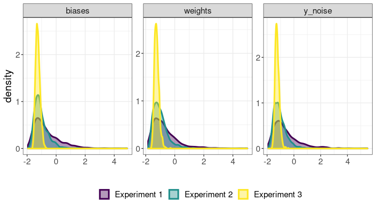

```{r setup, include=FALSE}
knitr::opts_chunk$set(echo = FALSE, fig.align="center")
```

# Objective

#### Background

- The parameters (weights and biases) of a Bayesian Neural Network (BNN) are generally assigned to __groups__

- The prior distributions for parameters in a groups share __common hyperparameters__

  - For example, all weights in the $j^{th}$ layer might be assigned priors: $P(w_{i,j}) = N(0, \sigma_j)$, $P(1/\sigma_j^2) = Gamma(\alpha, \beta)$

- The hyperparameters are also parameters of the probabilistic model, whose posterior distribution is a pre-requisite for the predictive distribution of target variable on unseen data

  - Thus, sampling the posterior distribution of the hyperparameters is arguably as important as the posterior of the low-level parameters (weights, biases)

#### Objective

- For BNNs with normal priors on weights/biases, a gamma distribution is oft-used to sample the precision of the normal distribution in a group

- Neal (1995) pioneered this idea, and used Gibbs sampling for sampling hyperparameters ($P(\sigma | w_{i,j})$ has an analytical form)

  - (The scheme couples Gibbs sampling on hyperparameters and Hamiltonian Monte Carlo updates on the weights)

- Our objective is to test if contemporary adaptive HMC methods (such as No-U-Turn sampler) offer a competitive replacement for Gibbs sampling for hyperparameter sampling in BNNs

#### Experiments Overview

- The experiments are conducted over __vague__ and __less vague__ priors for all groups of parameters

{width=225px, height=225px}

# Experiment 1 (0.05:0.5)

#### Assumptions

Architecture:

- 1 hidden layer, 8 hidden units
- tanh activation 
- _parameter groups_: input-hidden weights, hidden-output weights, hidden biases, output bias
- variance of hidden-output weights scaled by number of weights for better limiting behavior

Data:

- from FBM example 
- input dimensions = 1, output dimensions = 1

Hyperparameter Priors (FBM Notation):

- input-hidden weights hyperparameter: 0.05:0.5
- hidden-output weights hyperparameter: 0.05:0.5 
- hidden biases hyperparameter: 0.05:0.5
- output bias hyperparameter: 0.05:0.5
- target noise: 0.05:0.5

#### NUTS - Weight Traces

{width=225px, height=225px}

#### NUTS - Hyperparameter Traces

{width=225px, height=225px}

#### NUTS - Test Set Predictions

{width=225px, height=225px}

#### NUTS - Chain statistics

{width=225px, height=225px}

#### FBM - Weight Traces

{width=225px, height=225px}

#### FBM - Hyperparameter Traces

{width=225px, height=225px}

#### FBM - Test Set Predictions

{width=225px, height=225px}

# Experiment 2 (0.05:1)

#### Assumptions

Architecture:

- 1 hidden layer, 8 hidden units
- tanh activation 
- _parameter groups_: input-hidden weights, hidden-output weights, hidden biases, output bias
- variance of hidden-output weights scaled by number of weights for better limiting behavior

Data:

- from FBM example 
- input dimensions = 1, output dimensions = 1

Hyperparameter Priors (FBM Notation):

- input-hidden weights hyperparameter: 0.05:1
- hidden-output weights hyperparameter: 0.05:1
- hidden biases hyperparameter: 0.05:1
- output bias hyperparameter: 0.05:1
- target noise: 0.05:1

#### NUTS - Weight Traces

{width=225px, height=225px}

#### NUTS - Hyperparameter Traces

{width=225px, height=225px}

#### NUTS - Test Set Predictions

{width=225px, height=225px}

#### NUTS - Chain statistics

{width=225px, height=225px}

#### FBM - Weight Traces

{width=225px, height=225px}

#### FBM - Hyperparameter Traces

{width=225px, height=225px}

#### FBM - Test Set Predictions

{width=225px, height=225px}


# Experiment 3 (0.05:5)

#### Assumptions

Architecture:

- 1 hidden layer, 8 hidden units
- tanh activation 
- _parameter groups_: input-hidden weights, hidden-output weights, hidden biases, output bias
- variance of hidden-output weights scaled by number of weights for better limiting behavior

Data:

- from FBM example 
- input dimensions = 1, output dimensions = 1

Hyperparameter Priors (FBM Notation):

- input-hidden weights hyperparameter: 0.05:5
- hidden-output weights hyperparameter: 0.05:5 
- hidden biases hyperparameter: 0.05:5
- output bias hyperparameter: 0.05:5
- target noise: 0.05:5


#### NUTS - Weight Traces

{width=225px, height=225px}

#### NUTS - Hyperparameter Traces

{width=225px, height=225px}

#### NUTS - Test Set Predictions

{width=225px, height=225px}

#### NUTS - Chain statistics

{width=225px, height=225px}

#### FBM - Weight Traces

{width=225px, height=225px}

#### FBM - Hyperparameter Traces

{width=225px, height=225px}

#### FBM - Test Set Predictions

{width=225px, height=225px}
